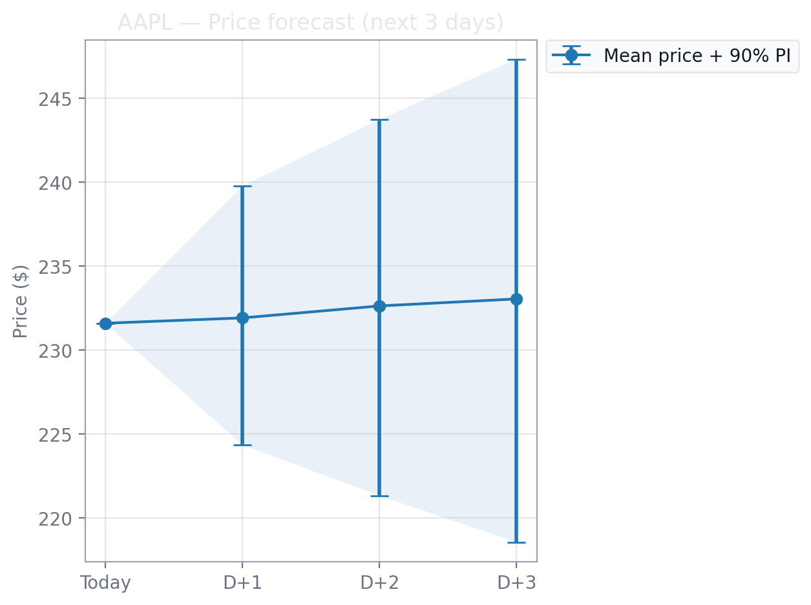

Bayesian Estimation of Sentiment Impact on Stock Prices

Saipavan Narayanasamy (24235785) · Shreemadhi Babu Rajendra Prasad (24207575)
M.Sc. in Data & Computational Science, University College Dublin

Poster : poster/final_project_poster_A0.pdf

Latest headlines → VADER sentiment → Bayesian Student-t regression (PyMC) → next-day log-return and multi-day price forecasts with uncertainty.

Contents

Demo / Screenshots

What the app does

Model in one slide

Install & Run

Using the app

Outputs & Run Log

Project structure

About the project

Limitations & future work

Tech stack

License

Cite

Acknowledgments

Demo / Screenshots

(Optional) drop a few PNGs into outputs/ and uncomment the lines below.

<!--    -->
What the app does

Headlines → sentiment. Pulls the latest news headlines per ticker and scores them with NLTK VADER (compound score), then averages by day to create a daily sentiment signal 
𝑧
𝑡
z
t
	​

.

Bayesian regression. Fits a Student-t regression of next-day log-return on yesterday’s sentiment (lag-1). Heavy-tailed noise handles outliers in financial returns.

Uncertainty first-class. We report 94% HDIs (posterior credible intervals) for parameters 
(
𝛼
,
𝛽
,
𝜎
,
𝜈
)
(α,β,σ,ν) and 90% prediction intervals for prices.

Forecasts. Produces next 3-day price forecasts (mean + 90% PI) from Monte-Carlo paths.

Comparison. A quick table for 
𝛽
β (sentiment effect) across two tickers + an indexed history vs forecast plot.

Reproducible log. Each run appends rows to results/predictions_log.csv (kept local by .gitignore so the repo stays slim).

Model in one slide

We model daily log-returns with heavy tails:

𝑟
𝑡
  
=
  
𝛼
  
+
  
𝛽
 
𝑧
𝑡
−
1
  
+
  
𝜀
𝑡
,
𝜀
𝑡
∼
Student-t
(
𝜈
,
0
,
𝜎
)
r
t
	​

=α+βz
t−1
	​

+ε
t
	​

,ε
t
	​

∼Student-t(ν,0,σ)

𝑟
𝑡
r
t
	​

: next-day log-return

𝑧
𝑡
−
1
z
t−1
	​

: yesterday’s (lag-1) VADER sentiment (daily average)

𝛼
,
𝛽
,
𝜎
,
𝜈
α,β,σ,ν: parameters inferred with PyMC (NUTS)

𝛽
β answers: does yesterday’s news sentiment move tomorrow’s return?

Price forecasts are obtained by transforming log-return scenarios to prices.

Install & Run

Python 3.9+ recommended.

# 1) Create and activate a virtual environment
python -m venv venv
# Windows
venv\Scripts\activate
# macOS/Linux
# source venv/bin/activate

# 2) Install packages
pip install -r requirements.txt

# 3) One-time: download VADER lexicon used by NLTK
python -m nltk.downloader vader_lexicon

# 4) Launch the app
streamlit run app/streamlit_app.py

Open the local URL shown by Streamlit (usually http://localhost:8501).

Using the app

Ticker A (required) and Ticker B (optional).

Run Speed: Fast / Standard / Accurate (controls MCMC draws / tuning).

Tabs:

Ticker 1 / Ticker 2: company blurb, Latest Headlines, Predicted Log-Return, Next Price (90% PI), Today’s Sentiment, Posterior Summary, 3-day Price Forecast (table + chart).

Comparison: quick table with 
𝛽
β (mean + 94% HDI) and day-1 price forecast; indexed history vs forecast dots.

Run log: a banner displays whether the log CSV was Created or Appended to. You can also download the log directly from the UI.

Outputs & Run Log

Figures & tables shown in the UI:

Predicted log-return (mean + 94% HDI)

Next price (mean + 90% PI)

Posterior summary for 
𝛼
,
𝛽
,
𝜎
,
𝜈
α,β,σ,ν with diagnostics (ESS, 
𝑅
^
R
^
)

3-day price forecast: table (day_ahead, price_mean, price_p05, price_p95) + chart

Run log CSV: results/predictions_log.csv (local; ignored by Git)

Contains timestamp, ticker, posterior summaries and key forecast numbers (including day-ahead price mean and prediction interval endpoints).

Useful for auditing, comparisons across runs, and lightweight experimentation.

The repository keeps results/ tracked only via a .gitkeep. This avoids committing large, ever-growing logs.

Project structure
app/
  streamlit_app.py            # Streamlit UI + modeling/forecast glue
poster/
  final_project_poster_A0.pdf # A0 poster
literature/                   # (add literature-review PDFs here)
outputs/                      # screenshots/exports (optional; .gitkeep added)
results/                      # run logs (local; ignored by Git; .gitkeep added)
requirements.txt
LICENSE

About the project

Motivation. Markets react to information; news headlines are a fast, public signal. We ask:

Can daily news-headline sentiment help predict a stock’s next-day return?

Design choices.

Use VADER (rule-based, fast, tuned for short social/news text) for sentiment.

Lag sentiment by one day (
𝑧
𝑡
−
1
z
t−1
	​

) to avoid look-ahead bias.

Model log-returns with a Student-t likelihood to handle fat tails/outliers.

Use Bayesian inference to quantify full uncertainty (HDIs, diagnostics).

What 
𝛽
β means.

𝛽
β is the marginal effect of yesterday’s sentiment on tomorrow’s log-return.

If the 94% HDI includes 0, we do not have robust evidence that daily sentiment shifts next-day returns (a common outcome in efficient markets).

We still propagate uncertainty to price forecasts (mean + 90% PI) to show what ranges are plausible given current information.

Deliverables.

Interactive Streamlit app

A0 poster summarizing problem, workflow, model, and results

Clean Git history with a v1.0.0 release

Reproducible environment via requirements.txt (+ optional lock file)

Limitations & future work

Signal strength. Daily sentiment is noisy; 
𝛽
β often has HDIs covering 0. Consider:

Longer horizons (weekly), alternative features (topic/NER, finance-tuned sentiment),

Intraday granularity with market-open/close windows,

Regime switching / time-varying coefficients.

Data coverage. Headlines vary by source; add richer sources / APIs and de-duplication.

Econometrics. Explore multivariate models (market/sector factors), hierarchical priors, or state-space models with stochastic volatility.

Evaluation. Backtesting with a rolling window; CRPS or quantile loss for PIs.

Disclaimer: For research/education only — not financial advice.

Tech stack

Python · Streamlit · PyMC · ArviZ · NumPy · pandas · Matplotlib · NLTK (VADER) · requests/bs4 · yfinance

License

MIT — see LICENSE.

Cite

If you reference this project:

Narayanasamy, S.; Rajendra Prasad, S.B. (2025). Bayesian Estimation of Sentiment Impact on Stock Prices. Version 1.0.0. MIT License.
Poster: poster/final_project_poster_A0.pdf.

Acknowledgments

VADER sentiment (NLTK)

PyMC / ArviZ for Bayesian modeling & diagnostics

News/price data providers used in the app (public headline sources; Yahoo price data)

UCD — ACM40960 Projects in Maths Modelling

Maintainers

Saipavan Narayanasamy — 24235785

Shreemadhi Babu Rajendra Prasad — 24207575
